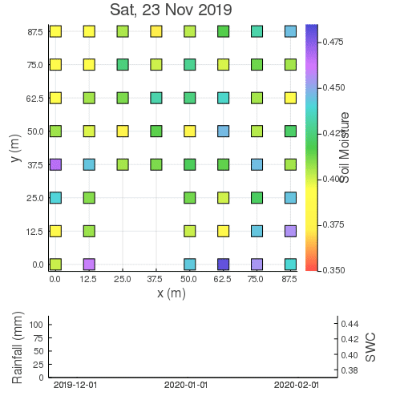

=============================
Sensor field of soil moisture
=============================
:Content: Heterogeneity of soil moisture in space and time
:Author: Dr. Alexandre A. Renchon
:Version: 1.0.0
:Homepage: https://arenchon.wordpress.com/

100 by 100 m grid of 64 sensors of soil moisture and temperature 

|Animation1|

Heatmap (interpolated)

|Heatmap|

.. |Heatmap| video:: ./images/Heatmap.mp4