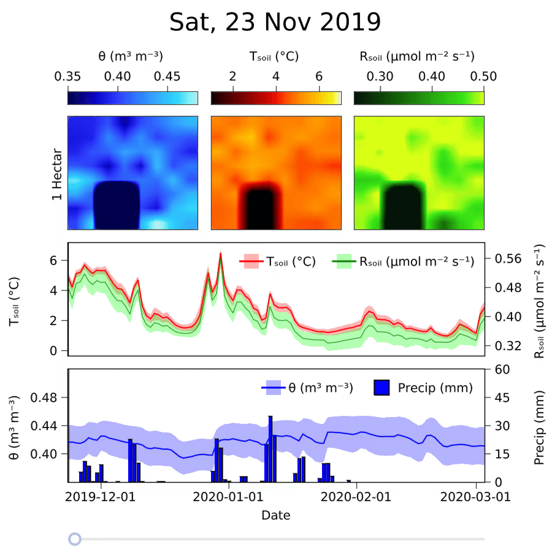

=============================
Sensor field of soil moisture
=============================
:Content: Heterogeneity of soil moisture in space and time
:Author: Dr. Alexandre A. Renchon
:Version: 0.0.1
:Homepage: https://github.com/AlexisRenchon/TEST

100 by 100 m grid of 64 sensors of soil moisture and temperature 

Interaction 2D

|Interaction2D|

